# Laporan Proyek Machine Learning
### Nama : Muhammad Nizar Amirullah
### Nim : 211351096
### Kelas : Pagi A

## Domain Proyek
Proyek ini bertujuan untuk mengembangkan sistem yang dapat mengidentifikasi dan mengklasifikasikan spesies iris berdasarkan fitur-fitur tertentu. Sistem ini akan menggunakan teknik machine learning untuk memproses dan menganalisis data spesies iris.

## Business Understanding
Membantu para ahli peneliti dalam mengidentifikasi dan mengklasifikasikan spesies iris dengan akurasi tinggi.

### Problem Statements
- Bagaimana cara untuk mengklasifikasikan bunga Iris dan mengidentifikasi jenisnya untuk mempelajari perilaku mereka dan membantu ahli biologi dengan teknik ML.

### Goals
- Mengidentifikasi dan menerapkan teknik pembelajaran mesin yang lebih canggih, serta melakukan eksperimen dengan berbagai algoritma klasifikasi untuk meningkatkan akurasi identifikasi spesies bunga Iris.

### Solution Statements
- Memanfaatkan teknik visualisasi data untuk mengeksplorasi hubungan antara atribut yang berbeda dari dataset iris
- Melakukan analisis statistik untuk mengidentifikasi korelasi dan pola dalam dataset iris.

## Data Understanding
Data ini menggunakan dataset yang berasal dari kaggle. Dataset ini berisi informasi spesies iris, terdiri dari 150 sampel bunga iris yang berasal dari tiga spesies yang berbeda. Setiap sampel memiliki empat fitur: panjang dan lebar kelopak, serta panjang dan lebar mahkota.

<br>[Iris Species](https://www.kaggle.com/datasets/uciml/iris).</br>

### Variabel-variabel pada Iris Spesies adalah sebagai berikut:
- Id : identifikasi
- SepalLengthCm : ukuran panjang
- SepalWidthCm : Ukuran lebar
- PetalLengthCm : Ukuran panjang 
- PetalWidthCm : Ukuran lebar 
- Species : Jenis atau spesies

## Data Preparation

### Data Collection
Untuk data collection ini, saya menggunakan dataset dengan judul Iris Species. Dataset tersebut didapatkan dari website kaggle.

## Data Discovery and Profiling
Disini saya menggunakan Teknik Decision Tree dan EDA.

#### Import library yang di butuhkan

Pertama kita mengimport semua library yang dibutuhkan.
```bash
import pandas as pd
import numpy as np
import seaborn as sns
import matplotlib.pyplot as plt
from sklearn.preprocessing import StandardScaler
from sklearn.preprocessing import LabelEncoder
from sklearn.model_selection import train_test_split
from sklearn.model_selection import cross_val_score
from sklearn.tree import DecisionTreeClassifier
from sklearn.metrics import accuracy_score
from sklearn.metrics import multilabel_confusion_matrix
from sklearn import tree
import graphviz
from sklearn.svm import SVC
from sklearn.tree import plot_tree
import pickle
```

#### Import Dataset Kaggle
Disini kita upload file kaggle.json
```bash
from google.colab import files
files.upload()
```

Selanjutnya setelah kita menggupload file kaggle kita, maka kita akan lanjut dengan membuat sebuah folder untuk menyimpan file kaggle.json yang sudah diupload tadi.
```bash
!mkdir -p ~/.kaggle
!cp kaggle.json ~/.kaggle/
!chmod 600 ~/.kaggle/kaggle.json
!ls ~/.kaggle
```

kita download datasetsnya.
```bash
!kaggle datasets download -d uciml/iris
```

kita extract file yang telah didownload.
```bash
!mkdir iris
!unzip iris.zip -d iris
!ls iris
```

#### Data Discovery
Memasukkan file csv yang telah diextract.
```bash
df = pd.read_csv("/content/iris/Iris.csv")
df.head()
```

Melihat mengenai type data dari masing masing kolom.
```bash
df.info()
```

Melihat jumlah baris dan kolom.
```bash
df.shape
```

Melihat daftar kolom.
```bash
df.columns
```
Menampilkan 10 baris pertama dari Data.
```bash
df.head(10)
```

Menghapus kolom 'Id'.
```bash
df.drop('Id', axis=1, inplace=True)
```

Melihat ringkasan statistik dari data.
```bash
df.describe()
```

#### EDA
Menampilkan gambar beberapa variabel numerik.
```bash
col_names = ['SepalLengthCm', 'SepalWidthCm', 'PetalLengthCm', 'PetalWidthCm']

fig, ax = plt.subplots(len(col_names), figsize=(8,40))

for i, col_val in enumerate(col_names):

    sns.boxplot(y=df[col_val], ax=ax[i])
    ax[i].set_title('Box plot - {}'.format(col_val), fontsize=10)
    ax[i].set_xlabel(col_val, fontsize=8)

plt.show()
```
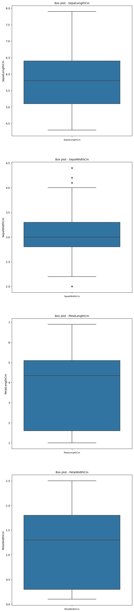

Melihat sebaran nilai dalam suatu variabel.
```bash
fig, ax = plt.subplots(len(col_names), figsize=(16,12))

for i, col_val in enumerate(col_names):

    sns.distplot(df[col_val], hist=True, ax=ax[i])
    ax[i].set_title('Freq dist '+col_val, fontsize=10)
    ax[i].set_xlabel(col_val, fontsize=8)
    ax[i].set_ylabel('Count', fontsize=8)

plt.show()
```
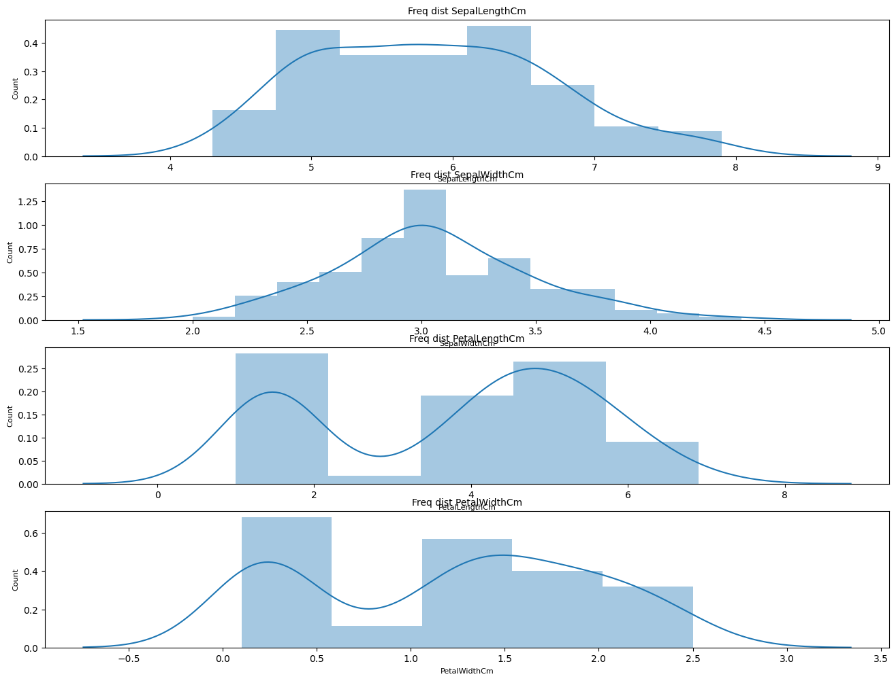

Menunjukkan satu baris dari data.
```bash
plt.scatter(df['SepalLengthCm'],df['SepalWidthCm'])
plt.show()
```
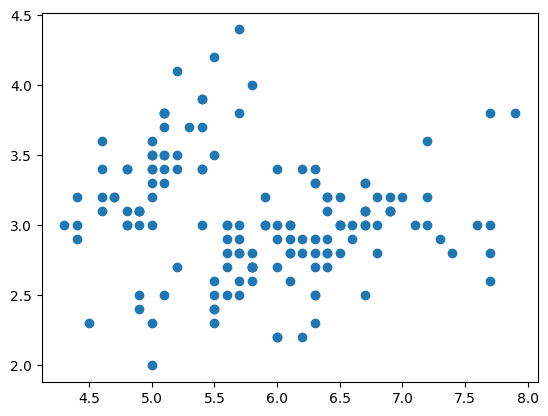

Menunjukkan persentase distribusi kelas dari data.
```bash
count_list = [(df.Species == 'Iris-setosa').sum(), (df.Species == 'Iris-versicolor').sum(), (df.Species == 'Iris-virginica').sum()]
label_list = list(df['Species'].unique())
plt.figure(figsize = (10,7))
plt.pie(count_list, labels = label_list, autopct = "%.2f %%", startangle = 90, explode = (0.1, 0.1, 0.0), textprops = {'fontsize': 12})
plt.title('Distribution of Classes', fontsize = 20)
plt.show()
```
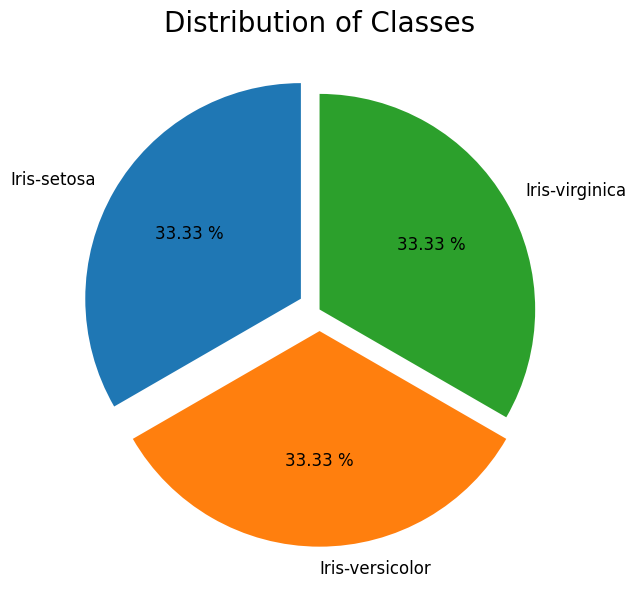

Untuk membedakan warna yang sesuai dengan setiap kelas.
```bash
sns.set_style('whitegrid')
sns.FacetGrid(df, hue = 'Species') \
   .map(plt.scatter, 'SepalLengthCm','SepalWidthCm') \
   .add_legend()

plt.show()
```
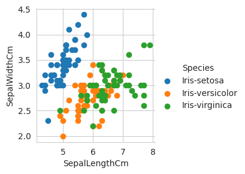

#### Data Preparation

Gambaran data yang hilang dalam setiap kolom.
```bash
df.isnull().sum()
```

Untuk melakukan analisis atau pemodelan pada data.
```bash
X = df[['SepalLengthCm', 'SepalWidthCm','PetalLengthCm', 'PetalWidthCm']]
Y = df['Species']
```

Untuk mengubah kelas-kelas pada variabel.
```bash
scaler = StandardScaler()
X = scaler.fit_transform(X)

label_encoder = LabelEncoder()
Y = label_encoder.fit_transform(Y)
```

Untuk membagi dataset menjadi dua set.
```bash
X_train, X_test, Y_train, Y_test = train_test_split(X,Y, test_size=0.1, random_state=123)
```

Memastikan hasil yang dapat direproduksi.
```bash
Xt, Xcv, Yt, Ycv = train_test_split(X_train, Y_train, test_size=0.10, random_state=42)
```

Untuk membuat model pohon keputusan.
```bash
tree_model = DecisionTreeClassifier()
tree_model = tree_model.fit(X_train, Y_train)
```

#### Modeling

Untuk membuat prediksi.
```bash
Y_pred = tree_model.predict(X_test)
acc_score= round(accuracy_score(Y_pred, Y_test), 3)
print('accuracy: ', acc_score)
```

Untuk mendapatkan hasil prediksi.
```bash
print(tree_model.predict([[6.2, 3.4, 5.4, 2.3]])[0])
```

Untuk melakukan validasi silang pada model klasifikasi.
```bash
print('Accuracy score is:',cross_val_score(Iris_clf, Xt, Yt, cv=3, scoring='accuracy').mean())
```

Untuk menghitung dan mencetak matriks konfusi multilabel.
```bash
Y_hat = Iris_clf.predict(Xcv)


print('Accuracy score for validation test data is:',accuracy_score(Ycv, Y_hat))
multilabel_confusion_matrix(Ycv , Y_hat)
```

Untuk menghitung dan mencetak matriks konfusi multilabel.
```bash
YT_hat = Iris_clf.predict(X_test)
YT_hat

print('Model Accuracy Score on totally unseen data(Xtest) is:',accuracy_score(Y_test, YT_hat)*100,'%')
multilabel_confusion_matrix(Y_test , YT_hat)
```

Untuk menghasilkan file dot.
```bash
iris = load_iris()
X = iris.data
y = iris.target

tree_model = DecisionTreeClassifier()
tree_model.fit(X, y)

feature_names = ['SepalLengthCm', 'SepalWidthCm', 'PetalLengthCm', 'PetalWidthCm']
class_names = ['Iris-setosa', 'Iris-versicolor', 'Iris-virginica']

export_graphviz(
    tree_model,
    out_file="iris_tree.dot",
    feature_names=feature_names,
    class_names=class_names,
    filled=True,
    rounded=True,
)
```

Membuat dan mengevaluasi model Suport Vector Machine (SVM).
```bash
svm = SVC()
svm.fit(X_train, Y_train)
Y_predsvm = svm.predict(X_test)
acc_svm= accuracy_score(Y_predsvm, Y_test)
print('The accuracy for SVM is : ', acc_svm*100, '%')
```

Menentukan jumlah minimum sampel yang diperlukan.
```bash
Fclf = DecisionTreeClassifier(criterion='gini',min_samples_split=2)
Fclf.fit(X_train, Y_train)
```

Untuk memvisualisasikan pohon keputusan.
```bash
tree.plot_tree(Fclf)
```

#### Visualisasi

Melihat representasi grafis dari pohon keputusan.
```bash
dot_df = tree.export_graphviz(Iris_clf, out_file=None)

graph = graphviz.Source(dot_df)
graph
```
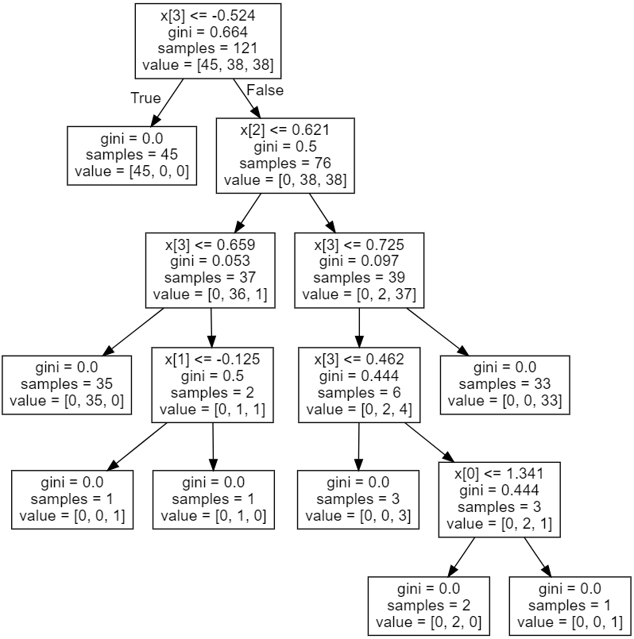

#### Pickle

Jika sudah berhasil jangan lupa untuk simpan model menggunakan pickle.
```bash
filename = 'iris.sav'
pickle.dump(tree_model.predict,open(filename,'wb'))
```

## Evaluation

Decision Tree adalah pohon dimana setiap cabangnya menunjukkan pilihan diantara sejumlah alternatif pilihan yang ada, dan setiap daunnya menunjukkan keputusan yang dipilih. kelebihan Decision Tree yaitu pengambilan keputusan yang sebelumnya kompleks dapat diubah menjadi lebih simpel dan spesifik.

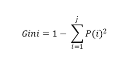

Akurasi Decision Tree merujuk pada seberapa tepat model tersebut dapat memprediksi kelas dari data yang diberikan.

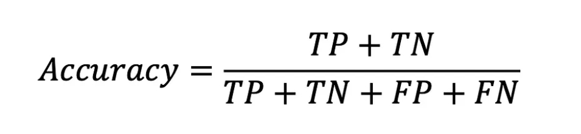

## Deployment

[My Estimation App](https://irisdecisiontree.streamlit.app/).


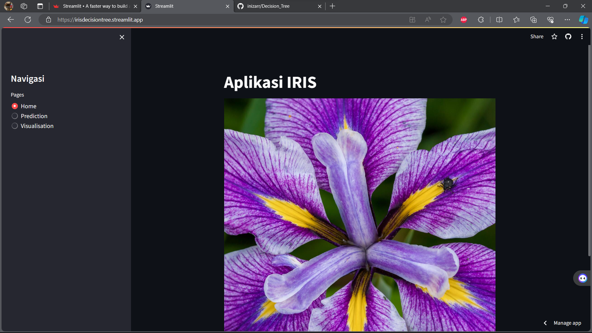
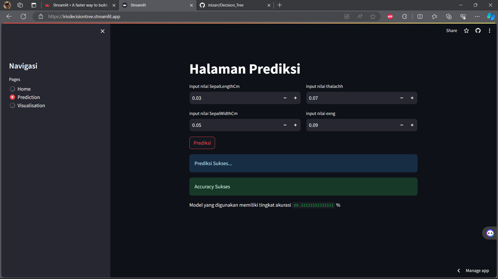
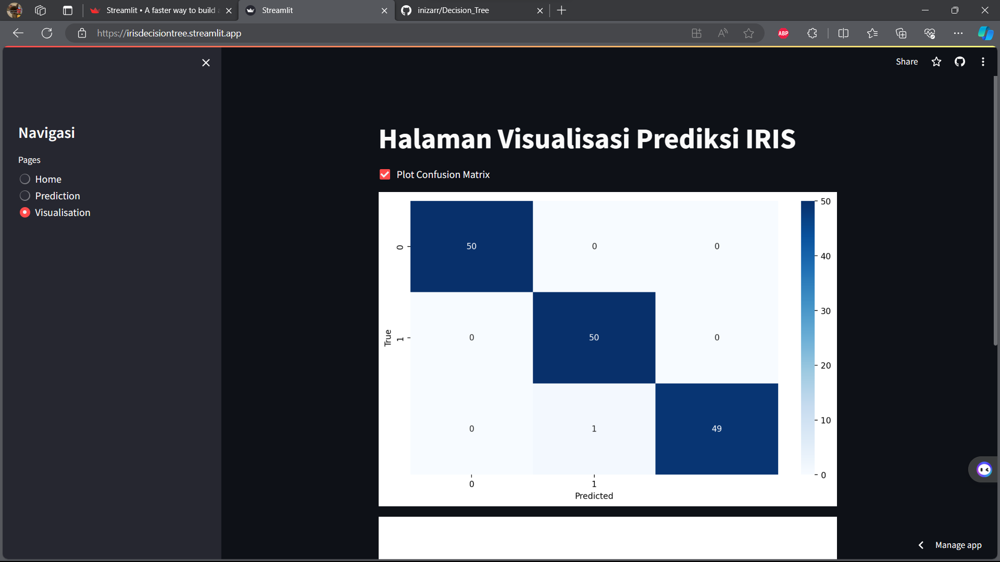
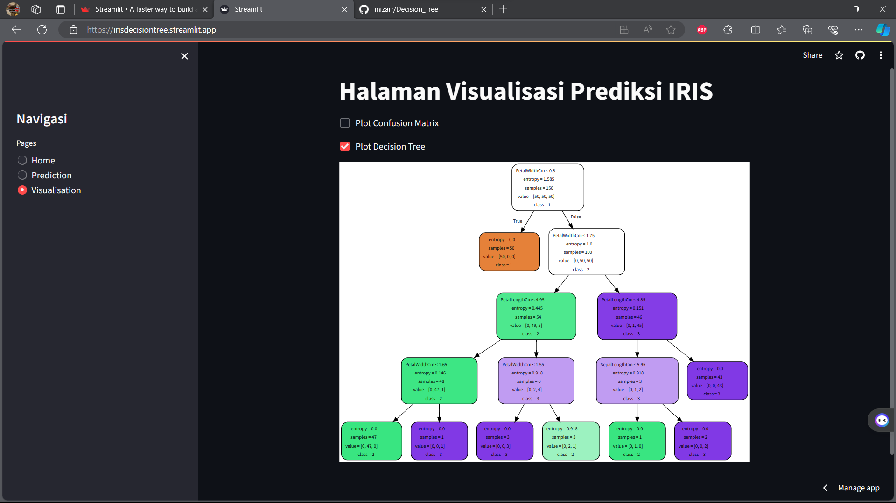